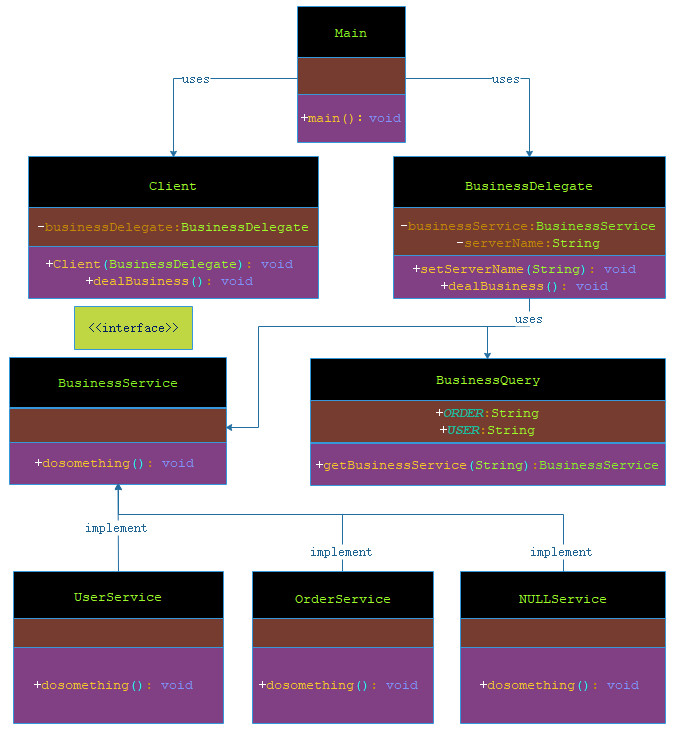

# 业务代表模式

***

###### 业务代表模式（Business Delegate Pattern）用于对表示层和业务层解耦。它基本上是用来减少通信或对表示层代码中的业务层代码的远程查询功能。在业务层中我们有以下实体。

###### 客户端（Client） - 表示层代码可以是 JSP、servlet 或 UI java 代码。

###### 业务代表（Business Delegate） - 一个为客户端实体提供的入口类，它提供了对业务服务方法的访问。

###### 查询服务（LookUp Service） - 查找服务对象负责获取相关的业务实现，并提供业务对象对业务代表对象的访问。

###### 业务服务（Business Service） - 业务服务接口。实现了该业务服务的实体类，提供了实际的业务实现逻辑。

***

## 实现

###### 我将创建 Client、BusinessDelegate、BusinessService、BusinessQuery、UserService 和 OrderService 以及空对象 NULLService 来表示业务代表模式中的各种实体。

###### Main，我的演示类使用 BusinessDelegate 和 Client 来演示业务代表模式的用法。



> 步骤 1：创建 BusinessService 接口。

**BusinessService.java**

```markdown

   package com.dao.pattern.business.interfaces;
   
   /**
    * 服务接口
    *
    * @author 阿导
    * @version 1.0
    * @fileName com.dao.pattern.business.interfaces.BusinessService.java
    * @CopyRright (c) 2018-万物皆导
    * @created 2018-04-04 10:20:00
    */
   public interface BusinessService {
       /**
        * 处理一些事情
        *
        * @author 阿导
        * @time 2018/4/4
        * @CopyRight 万物皆导
        * @param
        * @return void
        */
       void dosomething();
   }

```


> 步骤 2：创建实体服务类。

**UserService.java**

```markdown

    package com.dao.pattern.business.impl;
    
    import com.dao.pattern.business.interfaces.BusinessService;
    
    /**
     * 用户服务
     *
     * @author 阿导
     * @version 1.0
     * @fileName com.dao.pattern.business.impl.UserService.java
     * @CopyRright (c) 2018-万物皆导
     * @created 2018-04-04 10:54:00
     */
    public class UserService implements BusinessService {
    
        /**
         * 处理一些事情
         *
         * @return void
         * @author 阿导
         * @time 2018/4/4
         * @CopyRight 万物皆导
         */
        @Override
        public void dosomething() {
            System.out.println("处理用户服务");
        }
    }

```

**OrderService.java**

```markdown

    package com.dao.pattern.business.impl;
    
    import com.dao.pattern.business.interfaces.BusinessService;
    
    /**
     * 用户服务
     *
     * @author 阿导
     * @version 1.0
     * @fileName com.dao.pattern.business.impl.OrderService.java
     * @CopyRright (c) 2018-万物皆导
     * @created 2018-04-04 10:55:00
     */
    public class OrderService implements BusinessService{
    
        /**
         * 处理一些事情
         *
         * @return void
         * @author 阿导
         * @time 2018/4/4
         * @CopyRight 万物皆导
         */
        @Override
        public void dosomething() {
            System.out.println("处理订单服务");
        }
    }

```

**NULLService.java**

```markdown

    package com.dao.pattern.business.impl;
    
    import com.dao.pattern.business.interfaces.BusinessService;
    
    /**
     * 空服务
     *
     * @author 阿导
     * @version 1.0
     * @fileName com.dao.pattern.business.impl.NULLService.java
     * @CopyRright (c) 2018-万物皆导
     * @created 2018-04-04 11:25:00
     */
    public class NULLService implements BusinessService {
    
        /**
         * 处理一些事情
         *
         * @return void
         * @author 阿导
         * @time 2018/4/4
         * @CopyRight 万物皆导
         */
        @Override
        public void dosomething() {
            System.out.println("没有可用的服务！");
        }
    }

```

> 步骤 3：创建业务查询服务。

**BusinessQuery.java**

```markdown
    
    package com.dao.pattern.business.core;
    
    import com.dao.pattern.business.impl.*;
    
    import com.dao.pattern.business.interfaces.BusinessService;
    
    /**
     * 模拟注册中心，查询服务
     *
     * @author 阿导
     * @version 1.0
     * @fileName com.dao.pattern.business.core.BusinessQuery.java
     * @CopyRright (c) 2018-万物皆导
     * @created 2018-04-04 10:59:00
     */
    public class BusinessQuery {
        /**
         * 注册订单服务
         */
         public static final String ORDER="ORDER";
    
        /**
         * 注册用户服务
         */
        public static final String USER="USER";
    
        /**
         * 通过注册中心查询服务
         *
         * @author 阿导
         * @time 2018/4/4
         * @CopyRight 万物皆导
         * @param serverName
         * @return com.dao.pattern.business.interfaces.BusinessService
         */
        public static BusinessService getBusinessService(String serverName){
            if(ORDER.equalsIgnoreCase(serverName)){
                return new OrderService();
            }else if(USER.equalsIgnoreCase(serverName)){
                return new UserService();
            }
            return new NULLService();
        }
    
    }

```

> 步骤 4：创建业务代表。

**BusinessDelegate.java**

```markdown
    
    package com.dao.pattern.business.core;
    
    import com.dao.pattern.business.interfaces.BusinessService;
    
    /**
     * 创建业务代表
     *
     * @author 阿导
     * @version 1.0
     * @fileName com.dao.pattern.business.core.BusinessDelegate.java
     * @CopyRright (c) 2018-万物皆导
     * @created 2018-04-04 11:28:00
     */
    public class BusinessDelegate {
    
        /**
         * 业务接口
         */
        private BusinessService businessService;
        /**
         * 具体服务名
         */
        private String serverName;
    
    
        /**
         * 服务名，标识
         *
         * @author 阿导
         * @time 2018/4/4
         * @CopyRight 万物皆导
         * @param serverName
         * @return
         */
        public void setServerName(String serverName) {
            this.serverName = serverName;
        }
    
        /**
         * 处理业务
         *
         * @author 阿导
         * @time 2018/4/4
         * @CopyRight 万物皆导
         * @param
         * @return void
         */
        public void dealBusiness(){
            this.businessService=BusinessQuery.getBusinessService(this.serverName);
            this.businessService.dosomething();
        }
    }

```

> 步骤 5：创建客户端。

**Client.java**

```markdown

    package com.dao.pattern.business.core;
    
    /**
     * 客户端
     *
     * @author 阿导
     * @version 1.0
     * @fileName com.dao.pattern.business.core.Client.java
     * @CopyRright (c) 2018-万物皆导
     * @created 2018-04-04 11:59:00
     */
    public class Client {
        /**
         * 业务代表
         */
        private BusinessDelegate businessDelegate;
    
        /**
         * 构造方法
         *
         * @author 阿导
         * @time 2018/4/4
         * @CopyRight 万物皆导
         * @param businessDelegate
         * @return
         */
        public Client(BusinessDelegate businessDelegate) {
            this.businessDelegate = businessDelegate;
        }
    
        /**
         * 处理业务
         *
         * @author 阿导
         * @time 2018/4/4
         * @CopyRight 万物皆导
         * @param
         * @return void
         */
        public void dealBusiness(){
            this.businessDelegate.dealBusiness();
        }
    }

```

> 步骤 6：使用 BusinessDelegate 和 Client 类来演示业务代表模式。

    
**Main.java**

```markdown
   
   package com.dao.pattern.business.main;
   
   import com.dao.pattern.business.core.BusinessDelegate;
   import com.dao.pattern.business.core.BusinessQuery;
   import com.dao.pattern.business.core.Client;
   
   /**
    * 主程序入口
    *
    * @author 阿导
    * @version 1.0
    * @fileName com.dao.pattern.business.main.Main.java
    * @CopyRright (c) 2018-万物皆导
    * @created 2018-04-04 11:57:00
    */
   public class Main {
   
   
       /**
        * 主程序入口
        *
        * @author 阿导
        * @time 2018/4/4
        * @CopyRight 万物皆导
        * @param args
        * @return void
        */
       public static void main(String[] args){
           //创建业务代表
           BusinessDelegate businessDelegate=new BusinessDelegate();
           //创建客户端
           Client client=new Client(businessDelegate);
   
           //注入订单服务名
           businessDelegate.setServerName(BusinessQuery.ORDER);
           client.dealBusiness();
           //注入用户服务名
           businessDelegate.setServerName(BusinessQuery.USER);
           client.dealBusiness();
           //注入其他服务名
           businessDelegate.setServerName("AAA");
           client.dealBusiness();
       }
   }

```


> 步骤 7：验证输出。

```markdown
    
    处理订单服务
    处理用户服务
    没有可用的服务！
    
```
