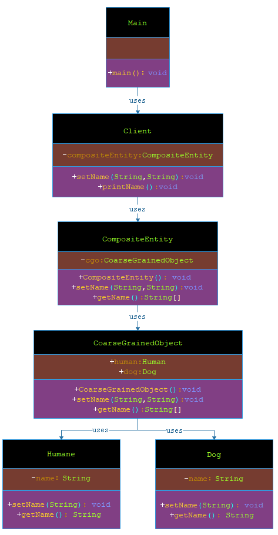

# 组合实体模式

***

###### 组合实体模式（Composite Entity Pattern）用在 EJB 持久化机制中。一个组合实体是一个 EJB 实体 bean，代表了对象的图解。当更新一个组合实体时，内部依赖对象 beans 会自动更新，因为它们是由 EJB 实体 bean 管理的。以下是组合实体 bean 的参与者。

- 组合实体（Composite Entity）：它是主要的实体 bean。它可以是粗粒的，或者可以包含一个粗粒度对象，用于持续生命周期。

- 粗粒度对象（Coarse-Grained Object）：该对象包含依赖对象。它有自己的生命周期，也能管理依赖对象的生命周期。

- 依赖对象（Dependent Object）：依赖对象是一个持续生命周期依赖于粗粒度对象的对象。

- 策略（Strategies）：策略表示如何实现组合实体。

***

## 实现

###### 我将创建作为组合实体的 CompositeEntity 对象。CoarseGrainedObject 是一个包含依赖对象的类。

###### Main，我的演示类使用 Client 类来演示组合实体模式的用法。




> 步骤 1：创建依赖对象。

**Human.java**

```markdown
    
    package com.dao.pattern.compositeentity.vo;
    
    /**
     * 人
     *
     * @author 阿导
     * @version 1.0
     * @fileName com.dao.pattern.compositeentity.vo.Human.java
     * @CopyRright (c) 2018-万物皆导
     * @created 2018-04-04 13:49:00
     */
    public class Human {
        /**
         * 人的名字
         */
        private String name;
    
        public String getName() {
            return name;
        }
    
        public void setName(String name) {
            this.name = name;
        }
    }

```

**Dog.java**

```markdown
    
    package com.dao.pattern.compositeentity.vo;
    
    /**
     * 狗
     *
     * @author 阿导
     * @version 1.0
     * @fileName com.dao.pattern.compositeentity.vo.Dog.java
     * @CopyRright (c) 2018-万物皆导
     * @created 2018-04-04 13:49:00
     */
    public class Dog {
        /**
         * 狗的名字
         */
        private String name;
    
        public String getName() {
            return name;
        }
    
        public void setName(String name) {
            this.name = name;
        }
    }

```

> 步骤 2：创建粗粒度对象。

**CoarseGrainedObject.java**

```markdown
    
    package com.dao.pattern.compositeentity.core;
    
    import com.dao.pattern.compositeentity.vo.Dog;
    import com.dao.pattern.compositeentity.vo.Human;
    
    /**
     * 粗粒度对象
     *
     * @author 阿导
     * @version 1.0
     * @fileName com.dao.pattern.compositeentity.core.CoarseGrainedObject.java
     * @CopyRright (c) 2018-万物皆导
     * @created 2018-04-04 13:51:00
     */
    public class CoarseGrainedObject {
        /**
         * 这是一个人
         */
        private Human human;
        /**
         * 人
         */
        private Dog dog;
    
        /**
         * 构造函数
         *
         * @author 阿导
         * @time 2018/4/4
         * @CopyRight 万物皆导
         * @param
         * @return
         */
        public CoarseGrainedObject() {
            human=new Human();
            dog=new Dog();
        }
    
        /**
         * 设置人和狗的名字
         *
         * @author 阿导
         * @time 2018/4/4
         * @CopyRight 万物皆导
         * @param humanName
         * @param dogName
         * @return void
         */
        public void setName(String humanName, String dogName){
            this.human.setName(humanName);
            this.dog.setName(dogName);
        }
    
        /**
         * 获取人和狗的名称
         *
         * @author 阿导
         * @time 2018/4/4
         * @CopyRight 万物皆导
         * @param
         * @return java.lang.String[]
         */
        public String[] getName(){
            return new String[]{this.human.getName(),this.dog.getName()};
        }
    }

```

> 步骤 3：创建组合实体。

**CompositeEntity.java**

```markdown

    package com.dao.pattern.compositeentity.core;
    
    /**
     * 组合实体
     *
     * @author 阿导
     * @version 1.0
     * @fileName com.dao.pattern.compositeentity.core.CompositeEntity.java
     * @CopyRright (c) 2018-万物皆导
     * @created 2018-04-04 14:11:00
     */
    public class CompositeEntity {
        /**
         * 声明粗粒度对象
         */
        private CoarseGrainedObject cgo;
    
        /**
         * 构造方法
         *
         * @author 阿导
         * @time 2018/4/4
         * @CopyRight 万物皆导
         * @param
         * @return
         */
        public CompositeEntity() {
            cgo=new CoarseGrainedObject();
        }
    
        /**
         * 设置人和狗的名字
         *
         * @author 阿导
         * @time 2018/4/4
         * @CopyRight 万物皆导
         * @param humanName
         * @param dogName
         * @return void
         */
        public void setName(String humanName, String dogName){
            this.cgo.setName(humanName, dogName);
        }
    
        /**
         * 获取人和狗的名称
         *
         * @author 阿导
         * @time 2018/4/4
         * @CopyRight 万物皆导
         * @param
         * @return java.lang.String[]
         */
        public String[] getName(){
            return cgo.getName();
        }
    
    }

```

> 步骤 4：创建使用组合实体的客户端类。

**Client.java**

```markdown
    
     package com.dao.pattern.compositeentity.core;
     
     /**
      * 客户端
      *
      * @author 阿导
      * @version 1.0
      * @fileName com.dao.pattern.compositeentity.core.Client.java
      * @CopyRright (c) 2018-万物皆导
      * @created 2018-04-04 14:25:00
      */
     public class Client {
         /**
          * 组合实体
          */
         private CompositeEntity compositeEntity;
     
         {
             compositeEntity = new CompositeEntity();
         }
     
         /**
          * 打印信息
          *
          * @author 阿导
          * @time 2018/4/4
          * @CopyRight 万物皆导
          * @param
          * @return void
          */
         public void printName(){
             int count=0;
             for(String name:compositeEntity.getName()){
                 if(count++==0) {
                     System.out.print(name+"养了一条狗，");
                 }else{
                     System.out.println("名字叫"+name+"。");
     
                 }
             }
         }
     
         /**
          * 设置人和狗的名字
          *
          * @author 阿导
          * @time 2018/4/4
          * @CopyRight 万物皆导
          * @param humanName
          * @param dogName
          * @return void
          */
         public void setName(String humanName, String dogName){
             compositeEntity.setName(humanName, dogName);
         }
     }


```

> 步骤 5：使用 Client 来演示组合实体设计模式的用法。

**Main.java**

```markdown
    
    package com.dao.pattern.compositeentity.main;
    
    import com.dao.pattern.compositeentity.core.Client;
    
    /**
     * 主程序入口
     *
     * @author 阿导
     * @version 1.0
     * @fileName com.dao.pattern.compositeentity.main.Main.java
     * @CopyRright (c) 2018-万物皆导
     * @created 2018-04-04 13:35:00
     */
    public class Main {
    
        /**
         * 主程序入口
         * @author 阿导
         * @time 2018/4/4
         * @CopyRight 万物皆导
         * @param args
         * @return void
         */
        public static void main(String[] args){
            //声明客户端
            Client client=new Client();
            //小明养了黑子这条狗
            client.setName("小明","黑子");
            client.printName();
            //刘鑫养了花花这条狗
            client.setName("刘鑫","花花");
            client.printName();
        }
    }

```

> 步骤 6：验证输出。

```markdown
    
    小明养了一条狗，名字叫黑子。
    刘鑫养了一条狗，名字叫花花。
    
```
