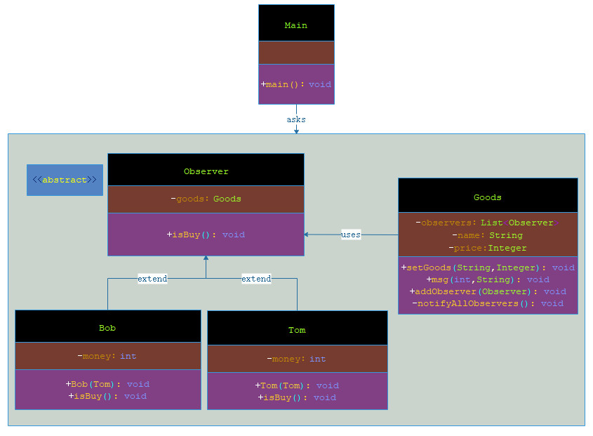

# 观察者模式

***

###### 当对象间存在一对多关系时，则使用观察者模式（Observer Pattern）。比如，当一个对象被修改时，则会自动通知它的依赖对象。观察者模式属于行为型模式。

***

## 介绍

- **意图**：定义对象间的一种一对多的依赖关系，当一个对象的状态发生改变时，所有依赖于它的对象都得到通知并被自动更新。

- **主要解决**：一个对象状态改变给其他对象通知的问题，而且要考虑到易用和低耦合，保证高度的协作。

- **何时使用**：一个对象（目标对象）的状态发生改变，所有的依赖对象（观察者对象）都将得到通知，进行广播通知。

- **如何解决**：使用面向对象技术，可以将这种依赖关系弱化。

- **关键代码**：在抽象类里有一个 ArrayList 存放观察者们。

- **应用实例**： 

> 1、拍卖的时候，拍卖师观察最高标价，然后通知给其他竞价者竞价。 

> 2、西游记里面悟空请求菩萨降服红孩儿，菩萨洒了一地水招来一个老乌龟，这个乌龟就是观察者，他观察菩萨洒水这个动作。

- **优点**： 

> 1、观察者和被观察者是抽象耦合的。 

> 2、建立一套触发机制。

- **缺点**： 

> 1、如果一个被观察者对象有很多的直接和间接的观察者的话，将所有的观察者都通知到会花费很多时间。 

> 2、如果在观察者和观察目标之间有循环依赖的话，观察目标会触发它们之间进行循环调用，可能导致系统崩溃。 

> 3、观察者模式没有相应的机制让观察者知道所观察的目标对象是怎么发生变化的，而仅仅只是知道观察目标发生了变化。

- **使用场景**：一个抽象模型有两个方面，其中一个方面依赖于另一个方面。将这些方面封装在独立的对象中使它们可以各自独立地改变和复用。
一个对象的改变将导致其他一个或多个对象也发生改变，而不知道具体有多少对象将发生改变，可以降低对象之间的耦合度。
一个对象必须通知其他对象，而并不知道这些对象是谁。需要在系统中创建一个触发链，A对象的行为将影响B对象，B对象的行为将影响C对象……，可以使用观察者模式创建一种链式触发机制。

- **注意事项**： 

> 1、JAVA 中已经有了对观察者模式的支持类。 

> 2、避免循环引用。 

> 3、如果顺序执行，某一观察者错误会导致系统卡壳，一般采用异步方式。

***

## 实现

###### 观察者模式使用两个个类 Goods、Observer 。Goods 可以添加观察者，观察者会根据观察商品进行判断自己是否有能力购买。我创建 Goods 类、Observer 抽象类和扩展了抽象类 Observer 的实体类。

###### Main，我的演示类使用 Goods 和实体类对象来演示观察者模式。




> 步骤 1：创建 Goods 类。

**Goods.java**

```markdown

    package com.dao.pattern.observer.vo;
    
    import com.dao.pattern.observer.core.Observer;
    
    import java.util.ArrayList;
    import java.util.List;
    
    /**
     * 购买能力
     *
     * @author 阿导
     * @version 1.0
     * @fileName com.dao.pattern.observer.vo.Goods.java
     * @CopyRright (c) 2018-万物皆导
     * @created 2018-03-30 10:19:00
     */
    public class Goods {
        /**
         * 观察者集合
         */
        private List<Observer> observers;
        /**
         * 商品名称
         */
        private String name;
        /**
         * 价格
         */
        private Integer price;
    
        //静态块初始化
        {
            observers = new ArrayList<>();
        }
    
        /**
         * 传入物品价格
         *
         * @param name
         * @param price
         * @return void
         * @author 阿导
         * @time 2018/3/30
         * @CopyRight 万物皆导
         */
        public void setGoods(String name, Integer price) {
            this.name = name;
            this.price = price;
            //通知所有的观察者
            notifyAllObservers();
        }
    
        /**
         * 钱能买此商品吗？
         *
         * @param money
         * @return void
         * @author 阿导
         * @time 2018/3/30
         * @CopyRight 万物皆导
         */
        public void msg(int money, String name) {
            if (money < this.price) {
                System.out.println(name + "只有" + money + "元，买不起价格为" + this.price+"的商品"+this.name);
            }else{
                System.out.println(name + "只有" + money + "元，可以买价格为" + this.price+"的商品"+this.name);
            }
        }
    
        /**
         * 添加观察者
         *
         * @param observer
         * @return void
         * @author 阿导
         * @time 2018/3/30
         * @CopyRight 万物皆导
         */
        public void addObserver(Observer observer) {
            observers.add(observer);
        }
    
        /**
         * 通知所有的观察者
         *
         * @param
         * @return void
         * @author 阿导
         * @time 2018/3/30
         * @CopyRight 万物皆导
         */
        private void notifyAllObservers() {
            for (Observer observer : observers) {
                observer.isBuy();
            }
        }
    }

```

> 步骤 2：创建 Observer 类。

**Observer.java**

```markdown

    package com.dao.pattern.observer.core;
    
    import com.dao.pattern.observer.vo.Goods;
    
    /**
     * 观察者
     *
     * @author 阿导
     * @version 1.0
     * @fileName com.dao.pattern.observer.core.Observer.java
     * @CopyRright (c) 2018-万物皆导
     * @created 2018-03-30 10:12:00
     */
    public abstract class Observer {
        /**
         * 能否购买的商品
         */
        protected Goods goods;
    
        /**
         * 能否购买的的价钱
         *
         * @author 阿导
         * @time 2018/3/30
         * @CopyRight 万物皆导
         * @param
         * @return void
         */
        public abstract void isBuy();
    }

```

> 步骤 3：创建实体观察者类。

**Bob.java**

```markdown

    package com.dao.pattern.observer.core;
    
    import com.dao.pattern.observer.vo.Goods;
    
    /**
     * 鲍勃来买东西
     *
     * @author 阿导
     * @version 1.0
     * @fileName com.dao.pattern.observer.core.Bob.java
     * @CopyRright (c) 2018-万物皆导
     * @created 2018-03-30 15:47:00
     */
    public class Bob extends Observer {
        /**
         * 鲍勃有多少钱
         */
        private int money;
        //初始化鲍勃拥有的钱
        {
            money=50;
        }
    
        /**
         * 初始化观察者鲍勃，让其关注商品
         *
         * @author 阿导
         * @time 2018/3/30
         * @CopyRight 万物皆导
         * @param goods
         * @return
         */
        public Bob(Goods goods) {
            this.goods=goods;
            this.goods.addObserver(this);
        }
    
        /**
         * 能否购买的的价钱
         *
         * @return void
         * @author 阿导
         * @time 2018/3/30
         * @CopyRight 万物皆导
         */
        @Override
        public void isBuy() {
            goods.msg(money,"鲍勃");
        }
    }

```

**Tom.java**

```markdown
    
    package com.dao.pattern.observer.core;
    
    import com.dao.pattern.observer.vo.Goods;
    
    /**
     * 汤姆来买东西
     *
     * @author 阿导
     * @version 1.0
     * @fileName com.dao.pattern.observer.core.Tom.java
     * @CopyRright (c) 2018-万物皆导
     * @created 2018-03-30 14:47:00
     */
    public class Tom extends Observer {
        /**
         * 汤姆有多少钱
         */
        private int money;
        //初始化汤姆拥有的钱
        {
            money=100;
        }
    
        /**
         * 初始化观察者汤姆，让其关注商品
         *
         * @author 阿导
         * @time 2018/3/30
         * @CopyRight 万物皆导
         * @param goods
         * @return
         */
        public Tom(Goods goods) {
            this.goods=goods;
            this.goods.addObserver(this);
        }
    
        /**
         * 能否购买的的价钱
         *
         * @return void
         * @author 阿导
         * @time 2018/3/30
         * @CopyRight 万物皆导
         */
        @Override
        public void isBuy() {
           goods.msg(money,"汤姆");
        }
    }

```


> 步骤 4：使用 Goods 和实体观察者对象。

**Main.java**

```markdown

    package com.dao.pattern.observer.main;
    
    import com.dao.pattern.observer.core.Bob;
    import com.dao.pattern.observer.core.Tom;
    import com.dao.pattern.observer.vo.Goods;
    
    import java.util.ArrayList;
    import java.util.List;
    
    /**
     * 主程序入口
     *
     * @author 阿导
     * @version 1.0
     * @fileName com.dao.pattern.observer.main.Main.java
     * @CopyRright (c) 2018-万物皆导
     * @created 2018-03-29 21:08:00
     */
    public class Main {
    
        /**
         * 主程序入口
         *
         * @author 阿导
         * @time 2018/3/29
         * @CopyRight 万物皆导
         * @param args
         * @return void
         */
        public static void main(String[] args){
            //商店初始化商品
            Goods goods=new Goods();
            //鲍勃带50元来买东西
            new Bob(goods);
            //汤姆带100元来买东西
            new Tom(goods);
    
            System.out.println("-----------听到第一件商品价格【第一件商品，纪念版笔记簿，20元】，两位顾客内心活动-----------\n");
            //第一件商品，纪念版笔记簿，20元
            goods.setGoods("纪念版笔记簿",20);
            System.out.println("\n-----------听到第二件商品价格【第二件商品，真男人 T 恤，70元】，两位顾客内心活动-----------\n");
            //第二件商品，真男人 T 恤，70元
            goods.setGoods("真男人 T 恤",70);
            System.out.println("\n-----------听到第三件商品价格【第三件商品，固态硬盘 256G，400元】，两位顾客内心活动-----------\n");
            //第三件商品，固态硬盘 256G，400元
            goods.setGoods("固态硬盘 256G",400);
            System.out.println("\n-------------------------------------------------");
    
        }
    }
    

```

> 步骤 5：验证输出。

```markdown
    
    -----------听到第一件商品价格【第一件商品，纪念版笔记簿，20元】，两位顾客内心活动-----------
    
    鲍勃只有50元，可以买价格为20的商品纪念版笔记簿
    汤姆只有100元，可以买价格为20的商品纪念版笔记簿
    
    -----------听到第二件商品价格【第二件商品，真男人 T 恤，70元】，两位顾客内心活动-----------
    
    鲍勃只有50元，买不起价格为70的商品真男人 T 恤
    汤姆只有100元，可以买价格为70的商品真男人 T 恤
    
    -----------听到第三件商品价格【第三件商品，固态硬盘 256G，400元】，两位顾客内心活动-----------
    
    鲍勃只有50元，买不起价格为400的商品固态硬盘 256G
    汤姆只有100元，买不起价格为400的商品固态硬盘 256G
    
    -------------------------------------------------
    
```
