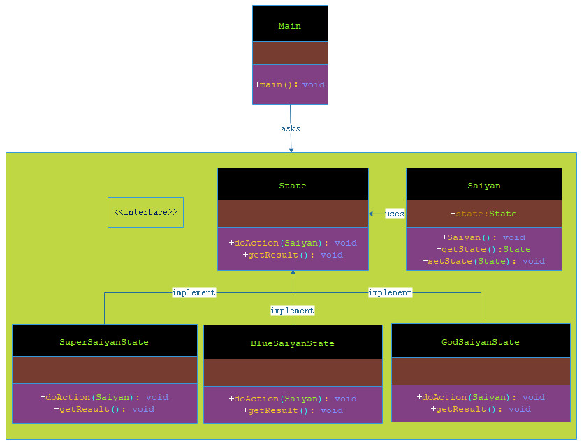

# 状态模式

***

###### 在状态模式（State Pattern）中，类的行为是基于它的状态改变的。这种类型的设计模式属于行为型模式。

###### 在状态模式中，我们创建表示各种状态的对象和一个行为随着状态对象改变而改变的 context 对象。

***

## 介绍

- **意图**：允许对象在内部状态发生改变时改变它的行为，对象看起来好像修改了它的类。

- **主要解决**：对象的行为依赖于它的状态（属性），并且可以根据它的状态改变而改变它的相关行为。

- **何时使用**：代码中包含大量与对象状态有关的条件语句。

- **如何解决**：将各种具体的状态类抽象出来。

- **关键代码**：通常命令模式的接口中只有一个方法。而状态模式的接口中有一个或者多个方法。而且，状态模式的实现类的方法，一般返回值，或者是改变实例变量的值。也就是说，状态模式一般和对象的状态有关。实现类的方法有不同的功能，覆盖接口中的方法。状态模式和命令模式一样，也可以用于消除 if...else 等条件选择语句。

- **应用实例**： 

> 1、打篮球的时候运动员可以有正常状态、不正常状态和超常状态。 

> 2、曾侯乙编钟中，'钟是抽象接口','钟A'等是具体状态，'曾侯乙编钟'是具体环境（Context）。

- **优点**： 

> 1、封装了转换规则。 

> 2、枚举可能的状态，在枚举状态之前需要确定状态种类。 

> 3、将所有与某个状态有关的行为放到一个类中，并且可以方便地增加新的状态，只需要改变对象状态即可改变对象的行为。 

> 4、允许状态转换逻辑与状态对象合成一体，而不是某一个巨大的条件语句块。 

> 5、可以让多个环境对象共享一个状态对象，从而减少系统中对象的个数。

- **缺点**： 

> 1、状态模式的使用必然会增加系统类和对象的个数。 

> 2、状态模式的结构与实现都较为复杂，如果使用不当将导致程序结构和代码的混乱。 

> 3、状态模式对"开闭原则"的支持并不太好，对于可以切换状态的状态模式，增加新的状态类需要修改那些负责状态转换的源代码，否则无法切换到新增状态，而且修改某个状态类的行为也需修改对应类的源代码。

- **使用场景**：
 
> 1、行为随状态改变而改变的场景。 

> 2、条件、分支语句的代替者。

- **注意事项**：在行为受状态约束的时候使用状态模式，而且状态不超过 5 个。

***

## 实现

###### 我们将创建一个 State 接口和实现了 State 接口的实体状态类。Saiyan [赛亚人]是一个带有某个状态的类。

###### Main，我们的演示类使用 Saiyan 和状态对象来演示 Saiyan 在状态改变时的行为变化。



> 步骤 1：创建一个接口。

**State.java**

```markdown

    package com.dao.pattern.state.core;
    
    import com.dao.pattern.state.vo.Saiyan;
    
    /**
     * 赛亚人的状态
     *
     * @author 阿导
     * @version 1.0
     * @fileName com.dao.pattern.state.core.State.java
     * @CopyRright (c) 2018-万物皆导
     * @created 2018-03-30 17:27:00
     */
    public interface State {
        /**
         * 处理赛亚人的状态
         *
         * @author 阿导
         * @time 2018/3/30
         * @CopyRight 万物皆导
         * @param saiyan
         * @return void
         */
        void doAction(Saiyan saiyan);
    
        /**
         * 赛亚人当前的状态
         *
         * @author 阿导
         * @time 2018/3/30
         * @CopyRight 万物皆导
         * @param
         * @return void
         */
        void getResult();
    }

```

> 步骤 2：创建实现接口的实体类。

**SuperSaiyanState.java**

```markdown
    
    package com.dao.pattern.state.core;
    
    import com.dao.pattern.state.vo.Saiyan;
    
    /**
     * 超级赛亚人
     *
     * @author 阿导
     * @version 1.0
     * @fileName com.dao.pattern.state.core.SuperSaiyanState.java
     * @CopyRright (c) 2018-万物皆导
     * @created 2018-03-30 17:31:00
     */
    public class SuperSaiyanState implements State {
    
        /**
         * 处理赛亚人的状态
         *
         * @param saiyan
         * @return void
         * @author 阿导
         * @time 2018/3/30
         * @CopyRight 万物皆导
         */
        @Override
        public void doAction(Saiyan saiyan) {
            System.out.println("===赛亚人正在向超级赛亚人状态改变===");
            saiyan.setState(this);
        }
    
        /**
         * 赛亚人当前的状态
         *
         * @return void
         * @author 阿导
         * @time 2018/3/30
         * @CopyRight 万物皆导
         */
        @Override
        public void getResult() {
            System.out.println("+++当前为超级赛亚人状态+++");
        }
    
    }

```

**BlueSaiyanState.java**

```markdown

    package com.dao.pattern.state.core;
    
    import com.dao.pattern.state.vo.Saiyan;
    
    /**
     * 赛亚人之蓝
     *
     * @author 阿导
     * @version 1.0
     * @fileName com.dao.pattern.state.core.BlueSaiyanState.java
     * @CopyRright (c) 2018-万物皆导
     * @created 2018-03-30 17:32:00
     */
    public class BlueSaiyanState implements State {
    
        /**
         * 处理赛亚人的状态
         *
         * @param saiyan
         * @return void
         * @author 阿导
         * @time 2018/3/30
         * @CopyRight 万物皆导
         */
        @Override
        public void doAction(Saiyan saiyan) {
            System.out.println("===赛亚人正在向赛亚人之蓝状态改变===");
            saiyan.setState(this);
        }
    
        /**
         * 赛亚人当前的状态
         *
         * @return void
         * @author 阿导
         * @time 2018/3/30
         * @CopyRight 万物皆导
         */
        @Override
        public void getResult() {
            System.out.println("+++当前为赛亚人之蓝状态+++");
        }
    }

```

**GodSaiyanState.java**

```markdown
    
    package com.dao.pattern.state.core;
    
    import com.dao.pattern.state.vo.Saiyan;
    
    /**
     * 赛亚人之神
     *
     * @author 阿导
     * @version 1.0
     * @fileName com.dao.pattern.state.core.GodSaiyanState.java
     * @CopyRright (c) 2018-万物皆导
     * @created 2018-03-30 17:32:00
     */
    public class GodSaiyanState implements State {
    
        /**
         * 处理赛亚人的状态
         *
         * @param saiyan
         * @return void
         * @author 阿导
         * @time 2018/3/30
         * @CopyRight 万物皆导
         */
        @Override
        public void doAction(Saiyan saiyan) {
            System.out.println("===赛亚人正在向赛亚人之神状态改变===");
            saiyan.setState(this);
        }
    
        /**
         * 赛亚人当前的状态
         *
         * @return void
         * @author 阿导
         * @time 2018/3/30
         * @CopyRight 万物皆导
         */
        @Override
        public void getResult() {
            System.out.println("+++当前为赛亚人之神状态+++");
        }
    }

```

> 步骤 3：创建 Saiyan 类。

**Saiyan.java**

```markdown
    
    package com.dao.pattern.state.vo;
    
    import com.dao.pattern.state.core.State;
    
    /**
     * 赛亚人
     *
     * @author 阿导
     * @version 1.0
     * @fileName com.dao.pattern.state.vo.Saiyan.java
     * @CopyRright (c) 2018-万物皆导
     * @created 2018-03-30 17:26:00
     */
    public class Saiyan {
        /**
         * 存储赛亚人的状态
         */
        private State state;
    
        /**
         * 赛亚人默认无状态
         *
         * @author 阿导
         * @time 2018/3/30
         * @CopyRight 万物皆导
         * @param
         * @return
         */
        public Saiyan() {
            state=null;
        }
    
        public State getState() {
            return state;
        }
    
        public void setState(State state) {
            this.state = state;
        }
    }

```

> 步骤 4：使用 Saiyan 来查看当状态 State 改变时的行为变化。

**Context.java**
```markdown

    public class Context {
       private State state;
    
       public Context(){
          state = null;
       }
    
       public void setState(State state){
          this.state = state;        
       }
    
       public State getState(){
          return state;
       }
    }
    
```

> 步骤 5：验证输出。

```markdown
    
    ===赛亚人正在向超级赛亚人状态改变===
    +++当前为超级赛亚人状态+++
    ===赛亚人正在向赛亚人之蓝状态改变===
    +++当前为赛亚人之蓝状态+++
    ===赛亚人正在向赛亚人之神状态改变===
    +++当前为赛亚人之神状态+++
    
```
