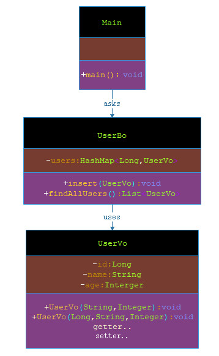

# 传输对象模式

***

###### 传输对象模式（Transfer Object Pattern）用于从客户端向服务器一次性传递带有多个属性的数据。传输对象也被称为数值对象。传输对象是一个具有 getter/setter 方法的简单的 POJO 类，它是可序列化的，所以它可以通过网络传输。它没有任何的行为。服务器端的业务类通常从数据库读取数据，然后填充 POJO，并把它发送到客户端或按值传递它。对于客户端，传输对象是只读的。客户端可以创建自己的传输对象，并把它传递给服务器，以便一次性更新数据库中的数值。以下是这种设计模式的实体。

- 业务对象（Business Object）：为传输对象填充数据的业务服务。

- 传输对象（Transfer Object）：简单的 POJO，只有设置/获取属性的方法。

- 客户端（Client）：客户端可以发送请求或者发送传输对象到业务对象。

***

## 实现

###### 我将创建一个作为业务对象的 UserBo 和作为传输对象的 UserVo，它们都代表了我们的实体。

###### Main，我的演示类在这里是作为一个客户端，将使用 UserBo 和 UserVo 来演示传输对象设计模式。



> 步骤 1：创建传输对象。

**UserVo.java**

```markdown
    
    package com.dao.pattern.transferobject.core;
    
    /**
     * 用户实体
     *
     * @author 阿导
     * @version 1.0
     * @fileName com.dao.pattern.transferobject.core.UserVo.java
     * @CopyRright (c) 2018-万物皆导
     * @created 2018-04-07 13:50:00
     */
    public class UserVo {
        /**
         * 主键 ID
         */
        private Long id;
    
        /**
         * 姓名
         */
        private String name;
    
        /**
         * 年龄
         */
        private Integer age;
    
        public UserVo(String name, Integer age) {
            this.name = name;
            this.age = age;
        }
    
        public UserVo(Long id, String name, Integer age) {
            this.id = id;
            this.name = name;
            this.age = age;
        }
    
        public Long getId() {
            return id;
        }
    
        public void setId(Long id) {
            this.id = id;
        }
    
        public String getName() {
            return name;
        }
    
        public void setName(String name) {
            this.name = name;
        }
    
        public Integer getAge() {
            return age;
        }
    
        public void setAge(Integer age) {
            this.age = age;
        }
    }

```

> 步骤 2：创建业务对象。

**UserBo.java**

```markdown

    package com.dao.pattern.transferobject.core;
    
    import java.util.ArrayList;
    import java.util.HashMap;
    import java.util.List;
    
    /**
     * 业务对象
     *
     * @author 阿导
     * @version 1.0
     * @fileName com.dao.pattern.transferobject.core.UserBo.java
     * @CopyRright (c) 2018-万物皆导
     * @created 2018-04-07 13:51:00
     */
    public class UserBo {
        /**
         * 模拟数据库
         */
        private HashMap<Long,UserVo> users;
    
        {
            users=new HashMap<>();
            users.put(1L,new UserVo(1L,"小明",18));
            users.put(2L,new UserVo(2L,"小花",20));
            users.put(3L,new UserVo(3L,"阿导",22));
        }
    
        /**
         * 新增用户
         *
         * @author 阿导
         * @time 2018/4/7
         * @CopyRight 万物皆导
         * @param userVo
         * @return void
         */
        public void insert(UserVo userVo){
            final Long[] id = {0L};
            users.forEach((k,v)->{
                if(k.intValue()> id[0].intValue()){
                    id[0] =k;
                }
            });
           userVo.setId(id[0]+1L);
           users.put(userVo.getId(),userVo);
        }
    
    
        /**
         * 查询所有的用户
         * @author 阿导
         * @time 2018/4/7
         * @CopyRight 万物皆导
         * @param
         * @return java.util.List<com.dao.pattern.transferobject.core.UserVo>
         */
        public List<UserVo> findAllUsers(){
            List<UserVo> userVos=new ArrayList<>();
            users.forEach((k,v)->userVos.add(v));
            return userVos;
        }
    }

```

> 步骤 3：使用 UserBo 来演示传输对象设计模式。

**Main.java**

```markdown
    
    package com.dao.pattern.transferobject.main;
    
    import com.alibaba.fastjson.JSON;
    import com.dao.pattern.transferobject.core.UserBo;
    import com.dao.pattern.transferobject.core.UserVo;
    
    /**
     * 主程序入口
     *
     * @author 阿导
     * @version 1.0
     * @fileName com.dao.pattern.transferobject.main.Main.java
     * @CopyRright (c) 2018-万物皆导
     * @created 2018-04-07 13:52:00
     */
    public class Main {
    
        /**
         * 主程序入口
         *
         * @author 阿导
         * @time 2018/4/7
         * @CopyRight 万物皆导
         * @param args
         * @return void
         */
        public static void main(String[] args){
            //声明业务对象
            UserBo userBo=new UserBo();
            //查询库里面的用户
            System.out.println("新增用户前："+JSON.toJSONString(userBo.findAllUsers()));
            //新增用户
            userBo.insert(new UserVo("柯西",26));
            //看看用户是否存入
            System.out.println("新增用户后："+JSON.toJSONString(userBo.findAllUsers()));
        }
    }

```

> 步骤 4：验证输出。

```markdown
    
    新增用户前：
    [
      {"age":18,"id":1,"name":"小明"},
      {"age":20,"id":2,"name":"小花"},
      {"age":22,"id":3,"name":"阿导"}
    ]
    新增用户后：
    [
      {"age":18,"id":1,"name":"小明"},
      {"age":20,"id":2,"name":"小花"},
      {"age":22,"id":3,"name":"阿导"},
      {"age":26,"id":4,"name":"柯西"}
    ]
    
```
